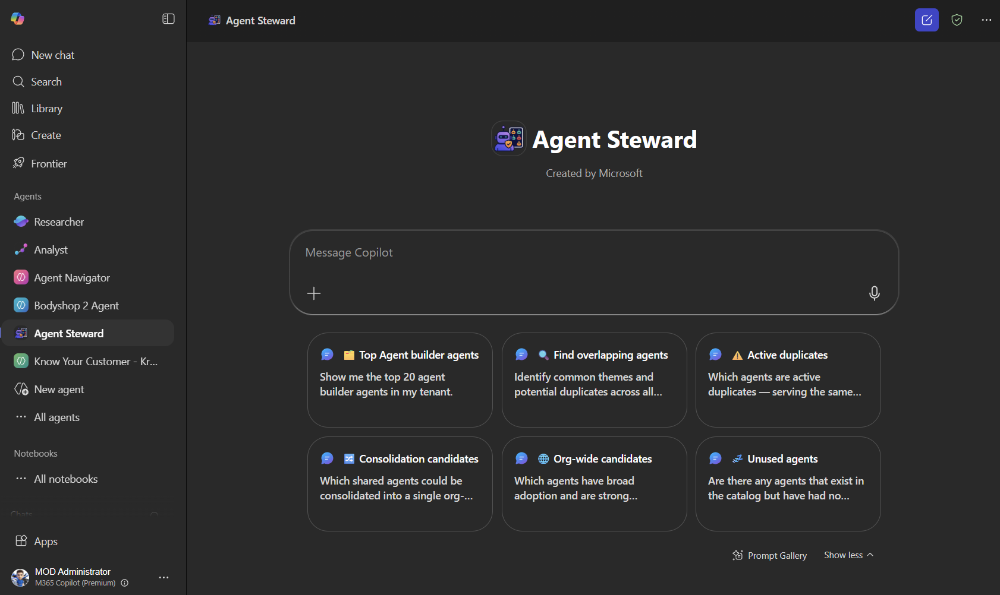
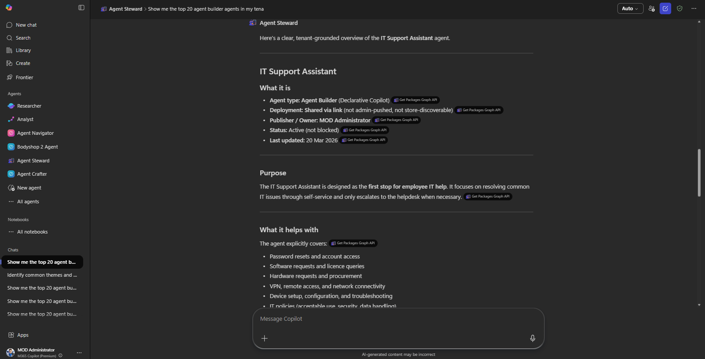
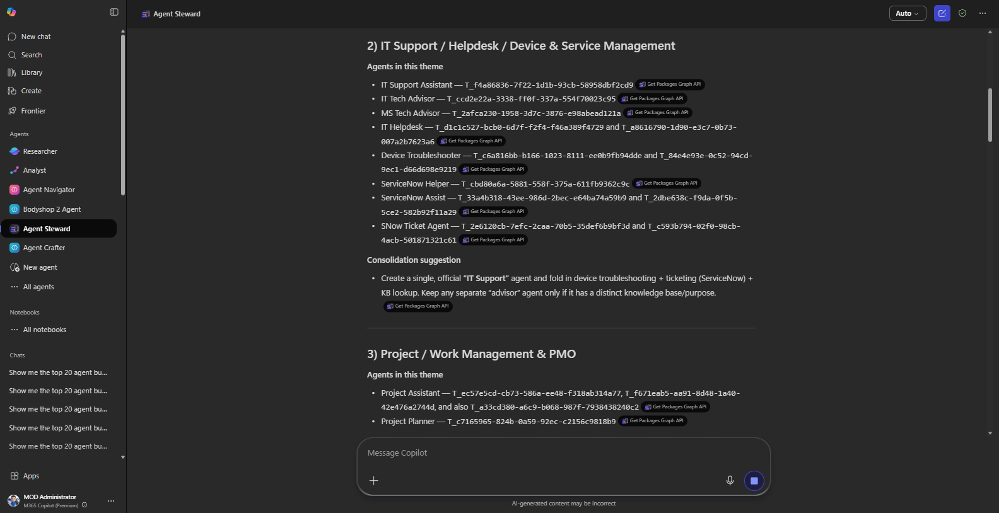

# Agent Steward

> **This is a sample.** Agent Steward is designed to showcase the art of the possible with the [Microsoft Graph Package Management (Inventory API)](https://learn.microsoft.com/en-us/microsoft-365/copilot/extensibility/api/admin-settings/package/resources/copilotpackagedetail). It is intended as a starting point and reference implementation, not a production-ready governance tool.

**Agent Steward** is a declarative agent for Microsoft 365 Copilot that helps IT admins and governance teams discover, analyse, and govern the Copilot agents deployed in their tenant. It connects to the Microsoft Graph Copilot Admin Catalog API to retrieve live package data, and cross-references that data with an uploaded usage report to surface actionable insights — with a particular focus on identifying duplicate agents and finding opportunities to consolidate fragmented deployments into org-wide agents.







---

## What it does

- **Inventory** — List and search all Copilot agents available in the tenant catalog, including agents built with Agent Builder, Copilot Studio, and first- and third-party agents.
- **Classify** — Identify how each agent was built (Agent Builder, Copilot Studio Custom Engine, 1st Party, or 3rd Party) based on package metadata.
- **Analyse usage** — Cross-reference the agent catalog with a usage report (uploaded to SharePoint) to see active user counts, response volumes, and last activity dates per agent.
- **Detect duplicates** — Identify active duplicates (multiple agents serving the same purpose with split user bases), orphaned agents (superseded but still in the catalog), catalog clutter (unused duplicates), and fragmented deployments (the same agent deployed across multiple scopes).
- **Identify org-wide candidates** — Surface agents with broad adoption or clusters of similar agents with high combined usage that could be consolidated and promoted as a single org-wide agent.
- **Recommend consolidation** — Provide clear, actionable recommendations: which agents to retire, which to consolidate, and which to promote org-wide.

## Recommended model

> **Use Think Deeper (or an equivalent deep reasoning mode) when interacting with Agent Steward.** Analysis tasks — such as identifying duplicates, grouping agents by theme, and recommending consolidation — require multi-step reasoning across large datasets. We have observed incomplete or inaccurate results when using Auto or Quick response modes. Select **Think Deeper** from the model picker in Microsoft 365 Copilot before submitting these queries.

## Sample prompts

- 🗂️ *Show the top 20 agent builder agents in my teannt.*
- 🔍 *Identify common themes and potential duplicates across all agents.*
- ⚠️ *Which agents are active duplicates — serving the same purpose with users split between them?*
- 🔀 *Which shared agents could be consolidated into a single org-wide agent?*
- 🌐 *Which agents have broad adoption and are strong candidates for org-wide promotion?*
- 💤 *Are there any agents that exist in the catalog but have had no usage?*

     {
            "title": "🗂️ Top Agent builder agents",
            "text": "Show me the top 20 agent builder agents in my tenant."
        },

---

## Prerequisites

- [Microsoft 365 Agents Toolkit VS Code Extension](https://aka.ms/teams-toolkit) version 5.0.0 or higher
- A Microsoft 365 tenant with [Microsoft 365 Copilot licences](https://learn.microsoft.com/microsoft-365-copilot/extensibility/prerequisites#prerequisites)
- An Entra ID app registration configured for delegated authentication against the Microsoft Graph Package Management API
- Users of the agent must hold the **Global Administrator** or **AI Administrator** role — the Package Management API only supports delegated authentication at the time of writing, so calls are made as the signed-in user and require admin privileges (**Application permissions are planned**)
- A SharePoint document library to host the agent usage report *(optional — see step 2)*

---

## Setup and deployment

### 1. Clone the repository

```bash
git clone https://github.com/microsoft/copilot-agent-inventory-samples.git
cd copilot-agent-inventory-samples/samples/agent-steward
```

### 2. Configure the SharePoint knowledge source *(optional)*

The agent can cross-reference the tenant catalog with a Copilot agent usage report to identify duplicates, assess adoption, and recommend consolidation. This requires uploading the report to a SharePoint document library and pointing the agent at it.

> **This step is optional.** Without it, the agent can still inventory and classify agents — it just won't have usage data to inform its analysis. If you do not want to use this feature, remove the `OneDriveAndSharePoint` entry from the `capabilities` array in [appPackage/declarativeAgent.json](appPackage/declarativeAgent.json) and skip to step 3.

#### Getting the usage report

There is currently no API for Copilot agent usage data. The report must be downloaded manually:

1. Sign in to the [Microsoft 365 admin centre](https://admin.microsoft.com).
2. Go to **Reports** > **Usage** > **Microsoft 365 Copilot** > **Agents** and export the agent usage report as a CSV file.

#### Configuring the knowledge source

1. Create (or identify) a SharePoint site and document library for the report that users of the agent will have access to.
2. **Upload the downloaded CSV file to that document library.** The agent identifies the usage report by its column structure, so the filename can be anything.
3. Open **env/env.dev.user** and set `SHAREPOINT_KNOWLEDGE_URL` to the URL of that library:

```
SHAREPOINT_KNOWLEDGE_URL=https://<your-tenant>.sharepoint.com/sites/<your-site>/Shared%20Documents
```

> This file is gitignored — your URL stays local and is never committed. The Agents Toolkit will substitute the value into `declarativeAgent.json` at build time.

### 3. Configure OAuth for the API plugin

The API plugin calls the Microsoft Graph Package Management API, specifically the Get and List methods (`/beta/copilot/admin/catalog/packages`) using OAuth via the `OAuthPluginVault` auth type. You need to register an OAuth configuration in the Teams Developer Portal and store the resulting registration ID in your local env file.

1. Register an application in [Entra ID](https://entra.microsoft.com) with the required Graph API permissions (Delegated) for the Package Management API - `CopilotPackages.Read.All`. Copy the **Client ID** as you will need this later.
2. Generate a client secret for the app registration and copy the **Value**.
3. Open the [Teams Developer Portal](https://dev.teams.microsoft.com) and go to **Tools** > **OAuth client registration**.
4. Select **New OAuth client registration** and fill in the details:
   - **Registration name** — a descriptive name (e.g. `Agent Steward`)
   - **Base URL** — `https://graph.microsoft.com`
   - **Client ID** — the Client ID copied in step 1
   - **Client secret** — the secret value copied in step 2
   - **Authorization endpoint** — `https://login.microsoftonline.com/common/oauth2/v2.0/authorize`
   - **Token endpoint** — `https://login.microsoftonline.com/common/oauth2/v2.0/token`
   - **Scopes** — `CopilotPackages.Read.All offline_access`
5. Save the registration and copy the **OAuth registration ID** — this is your `OAuthPluginVault` reference ID.
6. Open **env/env.dev.user** and set `OAUTH_PLUGIN_VAULT_REFERENCE_ID` to the value you obtained:

```
OAUTH_PLUGIN_VAULT_REFERENCE_ID=<your-reference-id>
```

> This file is gitignored — your reference ID stays local and is never committed. The Agents Toolkit will substitute the value into `ai-plugin.json` at build time.

### 4. Deploy with Microsoft 365 Agents Toolkit

1. Open the `samples/agent-steward` folder in VS Code.
2. Select the **Microsoft 365 Agents Toolkit** icon in the activity bar.
3. Sign in with your Microsoft 365 account in the **Accounts** section.
4. Select **Provision** to register the app in your tenant.
5. Once provisioned, open [Microsoft 365 Copilot](https://m365.cloud.microsoft/chat) and find **Agent Steward** in the agent list.
6. To deploy for multiple users, you will need to locate the appPackage zip file and share this with others to sideload or deploy into the MAC.

---

## Customisation

- **Instructions** — Edit [appPackage/instruction.txt](appPackage/instruction.txt) to adjust how the agent classifies agents, presents results, or handles edge cases.
- **Conversation starters** — Edit the `conversation_starters` array in [appPackage/declarativeAgent.json](appPackage/declarativeAgent.json) to tailor the suggested prompts for your organisation.
- **Knowledge sources** — Add additional SharePoint URLs or files to the `OneDriveAndSharePoint` capability to give the agent access to further governance documentation.

---

## References

- [Declarative agents for Microsoft 365](https://aka.ms/teams-toolkit-declarative-agent)
- [Microsoft Graph Package Management API](https://learn.microsoft.com/en-us/microsoft-365/copilot/extensibility/api/admin-settings/package/overview)
- [Extend Microsoft 365 Copilot with API plugins](https://learn.microsoft.com/microsoft-365-copilot/extensibility/overview-api-plugin)
- [Microsoft 365 Agents Toolkit documentation](https://learn.microsoft.com/microsoftteams/platform/toolkit/teams-toolkit-fundamentals)
- [Microsoft 365 Copilot extensibility samples](https://learn.microsoft.com/microsoft-365-copilot/extensibility/samples)

---

## Licence

MIT — see [LICENSE](../../LICENSE) for details.

> **Note:** This sample is community-maintained and is not covered by a Microsoft support SLA.
