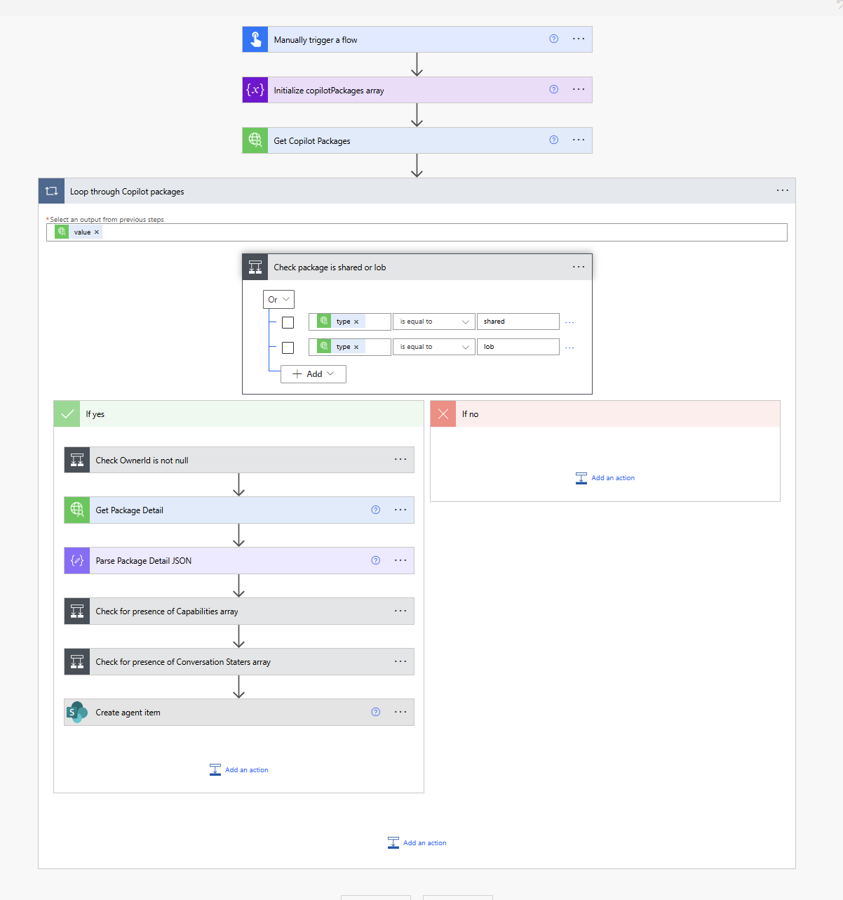

# Copilot Agent Inventory – SharePoint Sync

> **This is a sample.**
> This solution demonstrates how the **Microsoft Graph Package Management API** can be used with **Power Automate** to sync your tenant's Copilot agent inventory to a **SharePoint list** — giving IT admins a familiar, filterable, and shareable view of all agents without writing code.
>
> It is intended as a **reference implementation and starting point**, not a production-ready solution.

---

## Overview

This is an unmanaged Power Platform solution containing:

| Component | Description |
| --- | --- |
| **Power Automate flow** | A manually-triggered instant cloud flow that calls the Package Management API and creates an item in a SharePoint list for each Copilot agent. |
| **Custom connector** | The same [Copilot Agent Catalog](../catalog-connector/) custom connector — included in the solution for convenience. After import, you will need to configure it with your Entra ID app registration credentials and create a connection. |

Once imported and configured, triggering the flow populates your SharePoint list with the current agent inventory, ready for filtering, reporting, or feeding into downstream governance processes.

---

## Prerequisites

- A Microsoft 365 tenant with [Microsoft 365 Copilot licences](https://learn.microsoft.com/microsoft-365-copilot/extensibility/prerequisites#prerequisites)
- Access to the Package Management API — requires an Agent 365 license.
- An **Entra ID app registration** configured with the `CopilotPackages.Read.All` delegated permission (see the [Catalog Connector setup guide](../catalog-connector/README.md#1-create-an-entra-id-app-registration) for instructions).
- A **Power Platform environment** with permissions to import solutions (Environment Maker role or higher).
- The user account running the flow must hold the **Global Administrator** or **AI Administrator** role.
- A **SharePoint site** where you have permission to create lists.

---

## Setup and deployment

### 1. Create an Entra ID app registration

If you haven't already, create an app registration by following the instructions in the [Catalog Connector deployment guide](../catalog-connector/README.md#1-create-an-entra-id-app-registration). You will need the **Client ID**, **Client secret**, and **Tenant ID** for step 4.

### 2. Create the SharePoint list

1. Navigate to your target SharePoint site.
2. Select **+ New** > **List** > **Blank list**.
3. Give the list a name (e.g. `Agents`) and select **Create**.
4. Add the following columns to the list. Select **+ Add column** or **Create column** for each:

   | Column name | Type |
   | --- | --- |
   | Short Description | Multiple lines of text |
   | Blocked | Yes/No |
   | Last Modified | Date and Time |
   | Agent Type | Choice |
   | Instructions | Multiple lines of text |
   | Long Description | Multiple lines of text |
   | Capabilities | Multiple lines of text |
   | Graph Connector Ids | Multiple lines of text |
   | Websites | Multiple lines of text |
   | Id | Single line of text |
   | Owner | Person or Group |
   | ODSP Sites | Multiple lines of text |
   | Suggested Prompts | Multiple lines of text |
   | Discourage Model Knowledge | Yes/No |
   | Available To | Single line of text |
   | Deployed To | Single line of text |

#### Configure the Agent Type choices

After creating the columns, add the choice values for the **Agent Type** column:

1. Select the **Agent Type** column header.
2. Select **Column settings** > **Edit**.
3. Under **Choices**, add the following values:
   - `Agent Builder`
   - `Copilot Studio`
   - `LOB`
   - `Unknown`
4. Select **Save**.

### 3. Apply column formatting

Apply the provided column formatting JSON to improve the visual appearance of key columns:

#### Capabilities column

1. In the SharePoint list, select the **Capabilities** column header.
2. Select **Column settings** > **Format this column**.
3. In the formatting pane, select **Advanced mode**.
4. Delete any existing content and paste the contents of [`column-formatting/capabilities.json`](column-formatting/capabilities.json).
5. Select **Save**.

This displays each capability (e.g. WebSearch, Email, OneDriveAndSharePoint) as a colour-coded pill/badge.

#### Graph Connector Ids column

1. Select the **Graph Connector Ids** column header.
2. Select **Column settings** > **Format this column**.
3. In the formatting pane, select **Advanced mode**.
4. Delete any existing content and paste the contents of [`column-formatting/graph-connector-ids.json`](column-formatting/graph-connector-ids.json).
5. Select **Save**.

This displays connector IDs as a styled badge when present, or a dash when the field is empty.

### 4. Import the Power Platform solution

1. Go to [make.powerautomate.com](https://make.powerautomate.com) and select your target environment.
2. Navigate to **Solutions** > **Import solution**.
3. Select **Browse** and upload the [`CopilotAgentInventorySync_1_0_0_0.zip`](CopilotAgentInventorySync_1_0_0_0.zip) file.
4. You will be prompted to set **Environment Variables**. Configure them as follows:

   | Variable | Value |
   | --- | --- |
   | **Inventory Sync SharePoint Site** | Select the SharePoint site where you created the list in step 2. |
   | **Inventory Sync Agents List** | Select the SharePoint list you created in step 2 (e.g. `Agents`). |

5. Select **Import**.

### 5. Configure the custom connector and create a connection

The solution includes the custom connector, but you need to configure its OAuth credentials and create a connection. Follow steps 2 onwards from the [Catalog Connector deployment guide](../catalog-connector/README.md#setup-and-deployment):

1. **[Configure OAuth 2.0 authentication](../catalog-connector/README.md#3-configure-oauth-20-authentication)** — edit the imported connector's Security tab and enter your Client ID, Client secret, Tenant ID, and Resource URL from your Entra ID app registration (step 1).
2. **[Create a connection and test](../catalog-connector/README.md#4-create-a-connection-and-test)** — create a new connection and verify it works by testing the **Get Copilot Packages** operation.
3. Once you have a working connection, return to the imported solution in **Solutions**. Find the **Inventory Sync Copilot Packages Connection** connection reference, select **Edit**, and update it to use the connection you just created.

### 6. Run the flow

1. Navigate to the **Get Copilot Packages** flow within the solution.
2. Select **Run** to trigger a sync.

> **Note:** The flow run may report as failed if one or more agent owner IDs cannot be resolved to a user in your directory. Despite the failure status, agents that were processed before the error will still have been synced to the SharePoint list — only the agents where the owner could not be resolved will be missing. This is a known limitation and will be fixed in a future update.

---

## Screenshots

---

## How it works

1. The flow is triggered manually.
2. It calls the custom connector's **Get Copilot Packages** action to retrieve all agents.
3. For each agent in the response, it creates a new item in the configured SharePoint list with the agent's metadata mapped to the list columns.

> **Note:** The flow creates new items on each run. It does not update or deduplicate existing entries. To maintain a clean list, clear existing items before re-running, or extend the flow with upsert logic as needed.

---

## Known limitations

- Items are processed synchronously with a concurrency control of 1 (the default) to avoid API rate limits. This means large tenants with many agents may experience longer run times.
- The flow creates new list items only — it does not update existing entries if an agent's metadata has changed.
- The flow may fail if an agent's owner ID cannot be resolved (see [Run the flow](#6-run-the-flow) note above).

---

## Suggested enhancements

The following are improvements you could make to extend this sample:

| Enhancement | Description |
| --- | --- |
| **Separate into parent/child flows** | Split the solution so a parent flow calls **Get Copilot Packages** and a child (sub) flow retrieves the detail for each agent. This allows the child flow to run with higher concurrency without hitting API rate limits on the list operation. |
| **Upsert logic** | Enhance the flow to check whether an agent already exists in the SharePoint list (by ID) and update the existing item rather than creating a duplicate. |
| **Increase concurrency** | Once separated into parent/child flows, increase the concurrency control on the child flow to process multiple agents in parallel. |
| **Scheduled trigger** | Replace the manual trigger with a scheduled recurrence (e.g. daily) to keep the inventory list automatically up to date. |

---

## Planned future enhancements

The following features are planned for future releases of this sample:

- **Teams notifications** — notify administrators via Teams when new agents are created or existing agents are modified.
- **Automated blocking** — automatically block agents that do not meet governance criteria (e.g. missing attestation, no owner).
- **Automated deletion** — remove or archive agents that are orphaned or unused beyond a defined period.
- **Owner resolution fix** — handle unresolvable owner IDs gracefully so the flow completes successfully for all agents.

---

## References

- [Microsoft Graph Package Management API](https://learn.microsoft.com/en-us/microsoft-365/copilot/extensibility/api/admin-settings/package/overview)
- [Import a Power Platform solution](https://learn.microsoft.com/en-us/power-apps/maker/data-platform/import-update-export-solutions)
- [SharePoint list column formatting](https://learn.microsoft.com/en-us/sharepoint/dev/declarative-customization/column-formatting)
- [Catalog Connector sample](../catalog-connector/)

---

## Licence

MIT — see [LICENSE](../../LICENSE) for details.

> **Note:** This sample is community-maintained and is not covered by a Microsoft support SLA.
